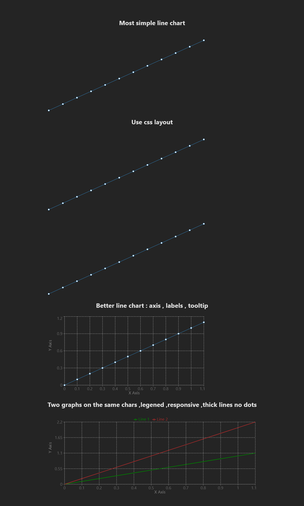

<h1>Recharts Playground</h1>

<p>A React playground project for exploring and demonstrating different chart implementations using the Recharts library.</p>

<h2>Project Description</h2>

<p>This project serves as a sandbox for experimenting with various chart types and configurations using Recharts. It includes examples ranging from basic line charts to more complex multi-line charts with responsive layouts, tooltips, legends, and custom styling.</p>

<h2>Motivation</h2>

<p>Created as a learning and prototyping tool for implementing charts in a pension calculation project. The goal was to understand how to visualize data showing how balance and monthly pension change with desired income values (ages 62-67). Recharts was selected as the charting library based on its React-native integration and feature set.</p>

<h2>Key Takeaways</h2>

<ul>
    <li><strong>Data transformation is crucial</strong>: Converting arrays to chart-compatible objects using <code>map()</code> functions is essential for Recharts integration</li>
    <li><strong>ResponsiveContainer enables responsive charts</strong>: Wrap charts in ResponsiveContainer to make them adapt to parent container width automatically</li>
    <li><strong>Multi-line charts require structured data</strong>: Use objects with multiple data keys (y1, y2) and separate Line components with custom styling for multiple data series</li>
</ul>


<h2>Installation</h2>

```bash
# Clone the repository
git clone <repository-url>
cd recharts-playground

# Install dependencies
pnpm install
```

<h2>Usage</h2>

```bash
# Start development server
pnpm run dev

# Build for production
pnpm run build

# Preview production build
pnpm run preview

# Run linting
pnpm run lint
```

<h2>Technologies Used</h2>

<ul>
    <li><strong>React</strong>: Frontend framework</li>
    <li><strong>TypeScript</strong>: Type safety and development experience</li>
    <li><strong>Recharts</strong>: Charting library built on D3</li>
    <li><strong>Vite</strong>: Build tool and development server</li>
    <li><strong>CSS Modules</strong>: Scoped styling</li>
    <li><strong>ESLint</strong>: Code linting and formatting</li>
</ul>

<h2>Code Structure</h2>

<p>Basic LineChart implementation:</p>

```tsx
<LineChart width={600} height={300} data={data1}>
  <Line dataKey="y" />
</LineChart>
```

<p>Data transformation from arrays to chart format:</p>

```tsx
const x = [0, 0.1, 0.2, 0.3, 0.4, 0.5, 0.6, 0.7, 0.8, 0.9, 1, 1.1];
const y1 = x.map((value) => value);
const data1 = x.map((value, index) => ({ x: value, y: y1[index] }));
```

<p>Multi-line responsive chart with custom styling:</p>

```tsx
<ResponsiveContainer width="100%" height={300}>
  <LineChart data={combinedData}>
    <CartesianGrid strokeDasharray="3 3" />
    <XAxis dataKey="x" label={{ value: "X Axis", position: "insideBottom", offset: -5 }} />
    <YAxis label={{ value: "Y Axis", angle: -90, position: "insideLeft" }} />
    <Tooltip />
    <Legend verticalAlign="top" />
    <Line dataKey="y1" stroke="green" strokeWidth={2} name="Line 1" dot={false} />
    <Line dataKey="y2" stroke="brown" strokeWidth={2} name="Line 2" dot={false} />
  </LineChart>
</ResponsiveContainer>
```


<h2>Demo</h2>

<p>The application showcases various chart implementations:</p>




<h2>Points of Interest</h2>

<ul>
    <li><strong>Recharts doesn't provide layout solutions</strong>: You need CSS (like CSS Modules) to arrange multiple charts on a page - the package only handles individual chart rendering</li>
</ul>

<h2>References</h2>

<ul>
    <li><a href="https://recharts.org/">Recharts Documentation</a></li>
    <li><a href="https://react.dev/">React Documentation</a></li>
    <li><a href="https://vitejs.dev/">Vite Documentation</a></li>
</ul>
